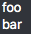
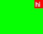
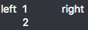
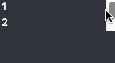

# Fusion - Reference

This reference aims to introduce the most important elements of Fusion. To learn Fusion, we recommend starting by reading [Getting Started](GettingStarted.md), and using [AutoReload](../AutoReload/README.md) to experiment.

## Table of contents

- [Layout](#layout)
  - [Stack](#stack)
  - [Dock](#dock)
  - [Composing](#composing)
  - [Centering](#centering)
  - [Padding / Margin](#padding--margin)
  - [Height / Width](#height--width)
  - [Scrolling](#scrolling)

## Layout

In Fusion, almost everything is built up by composing stack and dock layouts.

All controls default to fill their available space, unless otherwise specified.

### Stack
To create a stacking layout, use these:

- `Layout.StackFromTop`
- `Layout.StackFromBottom`
- `Layout.StackFromLeft`
- `Layout.StackFromRight`

#### Example

```cs
Layout.StackFromTop(
	Label.Create("foo"),
	Label.Create("bar"));
```



```cs
Layout.StackFromRight(
	Label.Create("foo"),
	Label.Create("bar"));
```


### Dock
To create a docking layout, use `Layout.Dock()`, followed by any of these:

- `Left()`
- `Right()`
- `Top()`
- `Bottom()`

And finally `Fill()` to fill the remaining space. (Note that the final `Fill()` is mandatory, but you can use `Fill()` with no parameters.)

#### Example:

```cs
return Layout.Dock()
	.Left(Label.Create("left"))
	.Right(Label.Create("right"))
	.Fill(Label.Create("middle", textAlignment:TextAlignment.Center));
```


You can also dock several things to the same side:

```cs
return Layout.Dock()
	.Left(Label.Create("left"))
	.Left(Label.Create("left2")) //Notice "Left" again
	.Fill(Label.Create("fill"));
```


#### Dock shortcuts

We have a set of shortcuts that put a control inside a dock panel and dock it to a specific place. These are convenient when you just want to dock something to one side, rather than having a full dock panel with other content for `Fill`.

- `DockLeft`
- `DockRight`
- `DockBottom`
- `DockTop`
- `DockTopLeft`
- `DockTopRight`
- `DockBottomLeft`
- `DockBottomRight`

#### Example

Docking something to top right:
```cs
Label.Create("hi")
	.WithBackground(Color.FromRgb(0xff0000))
	.DockTopRight()
	.WithBackground(Color.FromRgb(0x00ff00));
```

Here we create a label, give it a red background, dock that to the top right, and then give the encapsulating dock panel a green background.



### Composing

Layouts can of course also be composed.

#### Example:

```cs
Layout.Dock()
	.Left(Label.Create("left"))
	.Right(Label.Create("right"))
	.Fill(Layout.StackFromTop(
		Label.Create("1"),
		Label.Create("2")));
```



### Centering
There are three methods of centering a component within its parent:

- `Center`
- `CenterHorizontally`
- `CenterVertially`

#### Example:

```cs
Label.Create("foo");
```


```cs
Label.Create("foo").Center()
```


```cs
Label.Create("foo").CenterHorizontally();
```


```cs
Label.Create("foo").CenterVertically();
```


### Padding / Margin
We only have a concept of `Padding`. This adds padding *around* the element it's applied to. If you're coming from CSS, it helps to think of our padding as a margin in CSS.

`Padding` can be specified with a `Thickness<Points>` for all the edges, or individual `Optional<Points>` for each edge.

#### Example:

Specifying a general `Thickness<Points>`:

```cs
Label.Create("hi")
	.WithBackground(Color.FromRgb(0xff0000))
	.WithPadding(new Thickness<Points>(10))
	.WithBackground(Color.FromRgb(0x00ff00))
	.Center();
```


Specifying `Optional<Points>`:

```cs
Label.Create("hi")
	.WithBackground(Color.FromRgb(0xff0000))
	.WithPadding(new Points(5), new Points(10), new Points(15), new Points(20))
	.WithBackground(Color.FromRgb(0x00ff00))
	.Center();
```


This is a good point to note that both `WithBackground` and `WithPadding`, like most functions in Fusion, return an `IControl`. This is why it's so easy to compose things, and chain menthod calls like in the example above.

### Height / Width
You can use `WithWidth`, `WithHeight` and `WithSize` to control the width and height of a control

Note that these functions have no effect unless the control is inside another control which is allows it to use a non-full size, such as a `Stack` or `Dock`.

#### Example:

Specifying a width:

```cs
return Label.Create("hi")
	.WithBackground(Color.FromRgb(0xff0000))
	.WithWidth(new Points(42))
	.DockLeft(); //To allow the layout to collapse down to 42 points
```


Specifying a size:

```cs
return Label.Create("hi")
	.WithBackground(Color.FromRgb(0xff0000))
	.WithSize(new Size<Points>(42, 42))
	.DockLeft(); //To allow the layout to collapse down
```


## Scrolling

Use `MakeScrollable` to add scrolling capabilities to content that doesn't fit in its containing control:

```cs
return Layout.StackFromTop(
	Label.Create("1").WithHeight(new Points(20)),
	Label.Create("2").WithHeight(new Points(20)),
	Label.Create("3").WithHeight(new Points(20)))
	.MakeScrollable()
	.WithHeight(new Points(40))
	.DockTop();
```



## TODO
- Buttons, Labels, TextInput
- Panes, resizable stuff (MakeResizable)
- Brushes
- Fonts
- Icons
- Colours
- Background
- Context menu (SetContextMenu)
